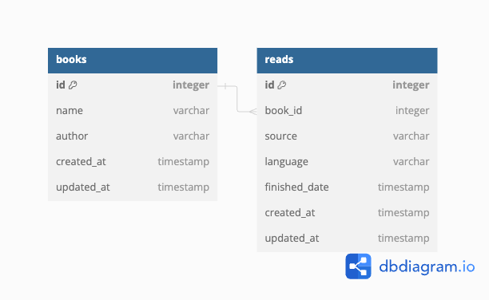

# my_books

## Context
### Motivation
I read some books a year, I also record which books I read in some days on a Note app. Sometimes I want to know how many books I read for each year, I manually count by my hands to retrieve the result. 

Hence, I write a personal book management application to save books I have read and retrieve some statistics I want efficiently. 

### Requirements
#### Functional

- User story 1. As a user, I want to make a request to create a book.
- User story 2. As a user, I want to make a request to create a read which records when, how I read a book.
- User story 3. As a user, I want to search if I have read a book before (in case I read thousands of books and can't remember clearly if I have read one).
- User story 4. As a user, I want to show how many books I read in a year, etc.

#### Non-functional

- Consistency: Server should be able to return understandable and instructable responses even user makes a corrupted request. 

#### Constraints & Challenge
Challenge 1. There isn't an always-on server
It is my personal application and I don't have a server hosted on cloud, I just only have a personal laptop which usually is on from 9am to 10pm everyday, the remaining time it is off.

## Decision
Based on the preceding context, it is logical to introduce a new module named My Books, tasked with creating book, read requests, querying the insight of books and reads in database.

To handle Challenge 1, My Books should have an ability to save all data in file system and automatically inserts them back into database when it is on back.

### Database design
Read [here](docs/database.md) to see how this design was decided.
```sql
Table books {
  id integer [primary key ]
  name varchar
  author varchar 
  created_at timestamp 
  updated_at timestamp
}

Table reads {
  id integer [primary key]
  book_id integer 
  source varchar
  language varchar
  finished_date timestamp 
  created_at timestamp
  updated_at timestamp 
}

Ref: reads.book_id > books.id 
```


### APIs 

#### Create a book
<details> 
    <summary><code>POST</code><code><b>/books</b></code></summary>
Tracker creates a book with this information

##### Body
| Name   | Required | Type   | Description            |
|--------|----------|--------|------------------------|
| name   | Y        | string | Name of the book       |
| author | Y        | string | Author of the the book |

##### Response 
| Status Code | Verdict           | Body                | Description                            |
|-------------|-------------------|---------------------|----------------------------------------|
| 200         | success           | `"data": {"id": 7}` | Success, Return id of the created book |
| 400         | invalid_parameter |                     |                                        |

##### Example 
- cURL

- Response

```json
{
  "data": {
    "id": 7
  },
  "message": "book is created successfully",
  "time": "2024-03-09T15:04:12+07:00",
  "verdict": "success"
}
```
</details>

#### Get list of books
<details> 
    <summary><code>GET</code><code><b>/books</b></code></summary>

##### Parameters
| Name     | Required | Type   | Description                                           |
|----------|----------|--------|-------------------------------------------------------|
| page     |          | int    | The page number of the results to fetch, default: 1   |
| per_page |          | int    | The number of results per page (max 100), default: 30 |
| search   |          | string | The key string to search on book name                 |

##### Response
| Status Code | Verdict           | Body                                                                                                                                                                       | Description                    |
|-------------|-------------------|----------------------------------------------------------------------------------------------------------------------------------------------------------------------------|--------------------------------|
| 200         | success           | `"data": {"count": 7,"items": [{ "id": 1,"name": "Giết con chim nhại","author": "","created_at": "2024-03-08T20:05:58+07:00","updated_at": "2024-03-08T20:05:58+07:00"}]}` | Success, Return  list of books |
| 400         | invalid_parameter |                                                                                                                                                                            |                                |

##### Example
- cURL

- Response

```json 
{
    "data": {
        "count": 7,
        "items": [
            {
                "id": 1,
                "name": "Giết con chim nhại",
                "author": "",
                "created_at": "2024-03-08T20:05:58+07:00",
                "updated_at": "2024-03-08T20:05:58+07:00"
            }
        ]
    },
    "message": "get list of books successfully",
    "time": "2024-03-09T15:30:05+07:00",
    "verdict": "success"
}
```
</details>

#### Create a read 
<details> 
    <summary><code>POST</code><code><b>/reads</b></code></summary>

Tracker creates a read with a created book

##### Body
| Name          | Required | Type      | Description                                          |
|---------------|----------|-----------|------------------------------------------------------|
| book_id       | Y        | int       | ID of the created book you have just finished read   |
| source        | Y        | string    | Source of book you read: hard_copy, soft_copy, audio |
| language      | Y        | string    | Language of the book you read, example: EN, VI       |
| finished_date | Y        | timestamp | Date you finish reading the book                     |

##### Response
| Status Code | Verdict   | Body                 | Description                        |
|-------------|-----------|----------------------|------------------------------------|
| 200         | success   | `"data": {"id": 7}`  | Success, Return ID of created read |
| 404         | not_found |                      |                                    |

</details>

#### Get list of reads
<details> 
    <summary><code>GET</code><code><b>/reads</b></code></summary>

##### Parameters
| Name      | Required | Type    | Description                                                             |
|-----------|----------|---------|-------------------------------------------------------------------------|
| page      |          | int     | The page number of the results to fetch, default: 1                     |
| per_page  |          | int     | The number of results per page (max 100), default: 30                   |
| from_year |          | string  | The start year to search on, example: 2012                              |
| to_year   |          | string  | The end year to search on, example: 2012                                |
| language  |          | string  | The language to search on, example: VI                                  |
| source    |          | string  | The source to search on, limited on values: hard_copy, soft_copy, audio |

##### Response
| Status Code | Verdict           | Body | Description                    |
|-------------|-------------------|------|--------------------------------|
| 200         | success           |      | Success, Return  list of reads |
| 400         | invalid_parameter |      |                                |
</details>

### References

- TS Dive-in 


### TODO
- UT for handler: test path
- POST, GET to same path
- id -> uuid
- should return id in GET /books?
- if client makes request: page_id, not support parameter? we reject or ignore?
- how can make language, source parameters not required in POST /reads
- restrict value of language is EN, VI
- catch error when book_id does not exist (remove manual check if book_id )
- do source value need to save in database? separate table
