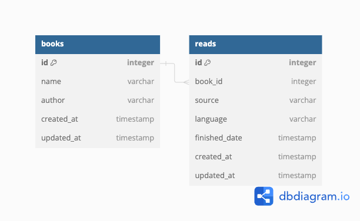

# my_books

## Context
### Motivation
I read some books a year, I also record which books I read in some days on a Note app. Sometimes I want to know how many books I read for each year, I manually count by my hands to retrieve the result. 

Hence, I write a personal book management application to save books I have read and retrieve some statistics I want efficiently. 

### Requirements
#### Functional

- User story 1. As a user, I want to make a request to create a book.
- User story 2. As a user, I want to make a request to create a read which records when, how I read a book.
- User story 3. As a user, I want to search if I have read a book before (in case I read thousands of books and can't remember clearly if I have read one).
- User story 4. As a user, I want to show how many books I read in a year, etc.

#### Non-functional

- Consistency: Server should be able to return understandable and instructable responses even user makes a corrupted request. 

#### Constraints & Challenge
Challenge 1. There isn't an always-on server
It is my personal application and I don't have a server hosted on cloud, I just only have a personal laptop which usually is on from 9am to 10pm everyday, the remaining time it is off.

## Decision
Based on the preceding context, it is logical to introduce a new module named My Books, tasked with creating book, read requests, querying the insight of books and reads in database.

To handle Challenge 1, My Books should have an ability to save all data in file system and automatically inserts them back into database when it is on back.

### Database design
Read [here](database.md) to see how this design was decided.
```sql
Table books {
  id integer [primary key ]
  name varchar
  author varchar 
  created_at timestamp 
  updated_at timestamp
}

Table reads {
  id integer [primary key]
  book_id integer 
  source varchar
  language varchar
  finished_date timestamp 
  created_at timestamp
  updated_at timestamp 
}

Ref: reads.book_id > books.id 
```


### API Specification

### References

- TS Dive-in 